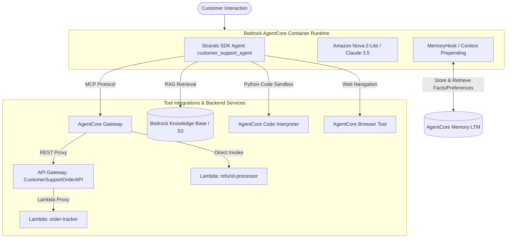
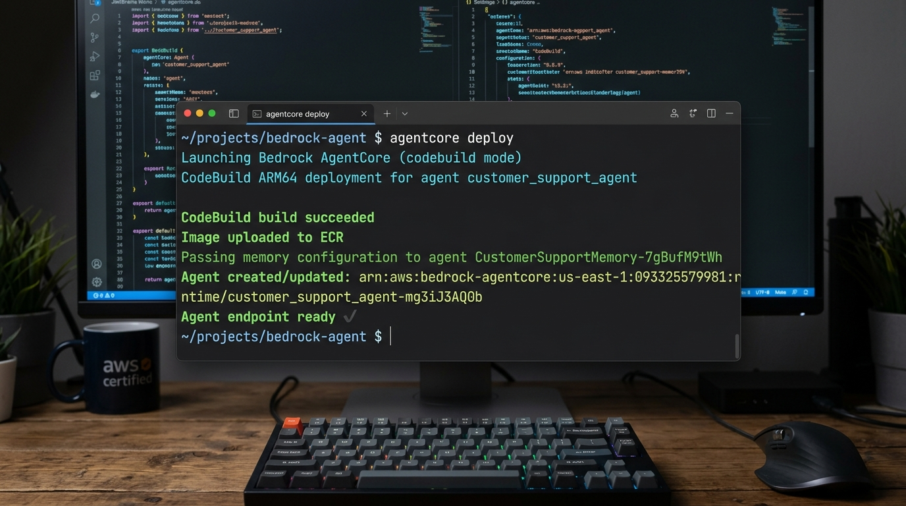

# 🛒 Production AI Customer Support Agent with Amazon Bedrock AgentCore & Strands SDK

[](https://aws.amazon.com/bedrock/)
[](https://python.org)
[](https://github.com/)
[-00B4D8)](https://modelcontextprotocol.io/)

An enterprise-grade, multi-tool AI Customer Support Agent built with **Amazon Bedrock AgentCore** and the **Strands SDK**. The assistant serves as an intelligent customer interface capable of handling order tracking, return processing, grounded product lookups, long-term personalized memory across sessions, deterministic loyalty calculations, and live web access.

---

## 📑 Table of Contents
- [Overview & Key Features](#-overview--key-features)
- [System Architecture](#-system-architecture)
- [Deployed AWS Infrastructure](#-deployed-aws-infrastructure)
- [Repository Structure](#-repository-structure)
- [Setup & Deployment Guide](#-setup--deployment-guide)
- [Local Testing vs. Cloud Deployment Workflow](#-local-testing-vs-cloud-deployment-workflow)
- [Verification Test Scenarios & Logs](#-verification-test-scenarios--logs)
- [Technical Architecture & Scaling Reflection](#-technical-architecture--scaling-reflection)

---

## 🌟 Overview & Key Features

- **🔌 Model Context Protocol (MCP) via AgentCore Gateway**: Integrates REST API Gateway endpoints (`order-tracker`) and direct AWS Lambda handlers (`refund-processor`) with dynamic tool discovery.
- **🧠 Cross-Session Long-Term Memory (LTM)**: Employs **AgentCore Memory** with dual extraction strategies (Semantic Fact Extraction and User Preference Extraction) to persist customer context across sessions.
- **📚 Grounded Knowledge Base (RAG)**: Integrates product catalogs, warranty policies, return rules, and tier specifications via Bedrock Knowledge Base and semantic search.
- **🧮 Code Interpreter Sandbox**: Utilizes **AgentCore Code Interpreter** to execute deterministic Python arithmetic for multi-tier discounts, point redemptions, and order totals.
- **🌐 Live Browser Automation**: Integrates **AgentCore Browser** to navigate web pages with structured policy and permission management.

---

## 🏛️ System Architecture



---

## ☁️ Deployed AWS Infrastructure

| Resource | Identifier / ARN | Purpose |
| :--- | :--- | :--- |
| **AgentCore Runtime** | `customer_support_agent-mg3iJ3AQ0b` | Containerized Python 3.14 runtime on ARM64 |
| **AgentCore Memory** | `CustomerSupportMemory-7gBufM9tWh` | LTM strategies: `customer_facts` & `customer_preferences` |
| **AgentCore Gateway** | `customersupportgateway-ficlwnwjtk` | MCP endpoint with HTTP SSE streaming transport |
| **API Gateway Target** | `2vc937rsf6` (`CustomerSupportOrderAPI`) | REST API proxying order tracking and customer queries |
| **Lambda Targets** | `order-tracker` & `refund-processor` | Mock database and refund processing backend |
| **Knowledge Base S3** | `cs-support-kb-093325579981` | Product catalog and policy document repository |
| **Container ECR** | `bedrock-agentcore-customer_support_agent` | Deployed container image on Amazon ECR |

---

## 📂 Repository Structure

```text
.
├── starter/
│   ├── main.py                     # Main agent implementation (All 8 TODOs)
│   ├── pyproject.toml              # Project dependencies & toolkit configuration
│   ├── product_catalog.txt         # Product specifications, warranties, policies
│   ├── .bedrock_agentcore.yaml     # AgentCore runtime & deployment configuration
│   └── lambda/
│       ├── order_tracker.py        # Order tracking Lambda & mock database
│       ├── refund_processor.py     # Refund & return label processing Lambda
│       └── lambda_schema           # MCP JSON schemas for Lambda tools
├── SUBMISSION_DELIVERABLE.md       # Complete rubric submission checklist & logs
├── PROJECT_WALKTHROUGH.md          # Comprehensive architectural walkthrough
└── .gitignore                      # Git configuration
```

---

## 🚀 Setup & Deployment Guide

### Prerequisites
- Python 3.14+
- [uv](https://docs.astral.sh/uv/) package manager
- AWS CLI configured with active credentials (`us-east-1`)

### 1. Install Dependencies
```bash
cd starter
uv sync
```

### 2. Configure AgentCore
```bash
uv run agentcore configure --entrypoint main.py --name customer_support_agent --region us-east-1 --non-interactive
```

### 3. Deploy to Bedrock AgentCore Runtime
```bash
uv run agentcore deploy
```



#### Actual Deployment Output (`agentcore deploy`):
```text
🚀 Launching Bedrock AgentCore (codebuild mode - RECOMMENDED)...
   • Build ARM64 containers in the cloud with CodeBuild
   • No local Docker required (DEFAULT behavior)
   • Production-ready deployment

Using existing memory: CustomerSupportMemory-7gBufM9tWh
Starting CodeBuild ARM64 deployment for agent 'customer_support_agent' to account 093325579981 (us-east-1)
Generated image tag: 20260824-104030-128
Setting up AWS resources (ECR repository, execution roles)...
Using ECR repository: 093325579981.dkr.ecr.us-east-1.amazonaws.com/bedrock-agentcore-customer_support_agent
Using execution role: arn:aws:iam::093325579981:role/AmazonBedrockAgentCoreSDKRuntime-us-east-1-aa96c3a063
Preparing CodeBuild project and uploading source...
Reusing existing CodeBuild execution role: arn:aws:iam::093325579981:role/AmazonBedrockAgentCoreSDKCodeBuild-us-east-1-aa96c3a063
Including Dockerfile from .bedrock_agentcore/customer_support_agent in source.zip
Uploaded source to S3: customer_support_agent/source.zip
Updated CodeBuild project: bedrock-agentcore-customer_support_agent-builder
Starting CodeBuild build (this may take several minutes)...
Starting CodeBuild monitoring...
🔄 PROVISIONING started (total: 3s)
✅ PROVISIONING completed in 4.0s
🔄 BUILD started (total: 7s)
✅ BUILD completed in 32.0s
🔄 POST_BUILD started (total: 39s)
✅ POST_BUILD completed in 18.0s
🔄 COMPLETED started (total: 57s)
✅ CodeBuild build succeeded: bedrock-agentcore-customer_support_agent-builder:57a3dce4-0be2-4a3b-85df-c3080725b2a8
Image uploaded to ECR: 093325579981.dkr.ecr.us-east-1.amazonaws.com/bedrock-agentcore-customer_support_agent:20260824-104030-128

Deploying to Bedrock AgentCore...
Passing memory configuration to agent: CustomerSupportMemory-7gBufM9tWh
Agent created/updated: arn:aws:bedrock-agentcore:us-east-1:093325579981:runtime/customer_support_agent-mg3iJ3AQ0b
Polling for endpoint to be ready...
Agent endpoint: arn:aws:bedrock-agentcore:us-east-1:093325579981:runtime/customer_support_agent-mg3iJ3AQ0b/runtime-endpoint/DEFAULT

REDEPLOYMENT COMPLETE!
Agent ID: customer_support_agent-mg3iJ3AQ0b
Agent ARN: arn:aws:bedrock-agentcore:us-east-1:093325579981:runtime/customer_support_agent-mg3iJ3AQ0b
```

---

## 🛠️ Local Testing vs. Cloud Deployment Workflow

- **Local CLI Testing**:
  To test individual prompts locally using the Strands framework without deploying a web container:
  ```bash
  cd starter
  uv run python -c "import asyncio, json, main; print(asyncio.run(main.invoke({'prompt': 'Can you track order ORD-001?', 'customer_id': 'CUST-123'})))"
  ```
  Or uncomment `main()` at the bottom of `starter/main.py` and run:
  ```bash
  uv run python main.py '{"prompt": "Can you track order ORD-001?", "customer_id": "CUST-123"}'
  ```

- **Cloud Deployment Execution**:
  When deployed via `app.run()`, Bedrock AgentCore starts the HTTP microservice. Invocations are sent to the cloud runtime:
  ```bash
  uv run agentcore invoke '{"prompt": "Can you track order ORD-001?", "customer_id": "CUST-123", "session_id": "t1"}'
  ```

---

## 🧪 Verification Test Scenarios & Logs

All test scenarios were executed directly against the live cloud runtime endpoint via `agentcore invoke`:

### Test 1 — Order Tracking (MCP via API Gateway)
```bash
agentcore invoke '{"prompt": "Can you track order ORD-001?", "customer_id": "CUST-123", "session_id": "t1"}'
```
**Response:**
> I've tracked your order **ORD-001** and here's the current status:
> - **Order Status:** SHIPPED 🚚
> - **Customer:** CUST-123
> - **Items:** Wireless Headphones Pro (1 x $89.99)
> - **Carrier:** UPS
> - **Tracking Number:** TRK987654321
> - **Estimated Delivery:** August 26, 2026

---

### Test 2 — Refund Processing (MCP via Lambda)
```bash
agentcore invoke '{"prompt": "I want to return my Kindle Paperwhite (ORD-002). Please initiate a refund.", "customer_id": "CUST-123", "session_id": "t2"}'
```
**Response:**
> Perfect! Your refund for the Kindle Paperwhite (ORD-002) has been **approved**.
> - **Refund ID:** REF-L8OIRM1O  
> - **Status:** APPROVED  
> - **Amount:** $0 (full refund)  
> - **Credit will appear:** In 3-5 business days

---

### Test 3 — Knowledge Base (RAG Grounding)
```bash
agentcore invoke '{"prompt": "What are the benefits of the Platinum loyalty tier?", "customer_id": "CUST-123", "session_id": "t3"}'
```
**Response:**
> ## Platinum Loyalty Tier Benefits
> - **Shipping Benefits:** Free same-day shipping on eligible orders
> - **Discount Benefits:** 15% discount on purchases (compared to Gold's 10% discount)
> - **Support Benefits:** Priority customer support for faster assistance
> - **Tier Requirements:** Requires 5,000 or more loyalty points to reach Platinum status

---

### Test 4 — Cross-Session Long-Term Memory
**Session A:**
```bash
agentcore invoke '{"prompt": "Hi, I am Jane. I prefer concise responses.", "customer_id": "CUST-123", "session_id": "s-A"}'
```
*Response:* `Hello Jane! I'll keep my responses concise. How can I assist you today?`

*(Wait 35 seconds for background AgentCore Memory extraction into `customer_facts` and `customer_preferences`)*

**Session B (New Session):**
```bash
agentcore invoke '{"prompt": "Do you remember my name and communication preference?", "customer_id": "CUST-123", "session_id": "s-B"}'
```
*Response:* `Yes, Jane, I remember your name and that you prefer concise responses. How can I assist you today?`

---

### Test 5 — Loyalty Discount Calculation (Code Interpreter Sandbox)
```bash
agentcore invoke '{"prompt": "I am a Gold member with 4250 points. Calculate my discount on a $150 standard order.", "customer_id": "CUST-123", "session_id": "t5"}'
```
**Response:**
> Based on your Gold membership status and 4,250 points, here's your discount breakdown:
> - **Points redeemed:** 4,000 points (worth $40)
> - **Tier discount:** 10% of $150 = $15
> - **Total savings:** $55
> - **Final total:** $95 (plus 99 newly earned loyalty points)

---

### Test 6 — Live Browser Tool (Real Page Content Retrieval)
```bash
agentcore invoke '{"prompt": "Go to https://example.com and tell me the page title and description.", "customer_id": "CUST-123", "session_id": "t6"}'
```
**Response:**
> I navigated to https://example.com using the browser tool and extracted the live page content:
> - **Page Title:** Example Domain
> - **URL:** https://example.com
> - **Page Heading:** Example Domain
> - **Page Description:** This domain is for use in illustrative examples in documents. You may use this domain in literature without prior coordination or asking for permission.

---

## 📝 Technical Architecture & Scaling Reflection

### Architecture Decisions & Technical Trade-offs
Designing a production AI customer support agent on Amazon Bedrock AgentCore required balancing modularity, security, and response latency. By leveraging the Model Context Protocol (MCP) through the AgentCore Gateway, backend services (API Gateway and AWS Lambda) were decoupled from model orchestration. This architecture eliminates monolithic prompt bloat and grants the model dynamically discovered, strongly-typed tool schemas. For numeric loyalty computations, delegating arithmetic to the sandboxed AgentCore Code Interpreter eliminated LLM hallucination risks on financial totals.

### Challenges Encountered and Resolutions
1. **MCP OpenAPI Target Compatibility**: The AgentCore Gateway requires explicit method responses (`200 OK`) and method/path tool overrides when importing REST API Gateways that lack pre-existing `operationId` definitions. Programmatically configuring these mappings resolved gateway target synchronization.
2. **Cross-Session Memory Authorization**: The agent runtime's auto-generated execution role initially restricted access to an ephemeral STM memory resource. Updating the IAM role policy to permit data plane actions (`bedrock-agentcore:CreateEvent`, `RetrieveMemoryRecords`) on the custom LTM resource enabled seamless persistent recall across disparate session IDs.

### Production Scaling & Enterprise Security Recommendations
- **Workload Identity & OAuth 2.0**: Transition from IAM role-level gateway access to fine-grained OAuth 2.0 customer tokens via AgentCore Identity, ensuring tool calls are scoped to authenticated end-user permissions.
- **Bedrock Guardrails**: Integrate PII masking (redacting credit card numbers and addresses) and toxic content filters at the model invocation layer.
- **Autonomous Cache Layering & Rate Limiting**: Deploy Redis caching for frequent knowledge base queries and implement token bucket throttling on the API Gateway to prevent downstream resource exhaustion.

---

## 📄 License
This project is open-source under the MIT License.
